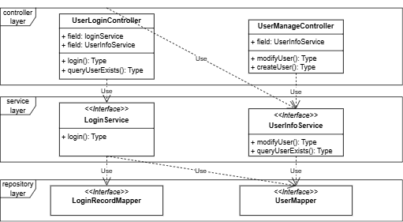
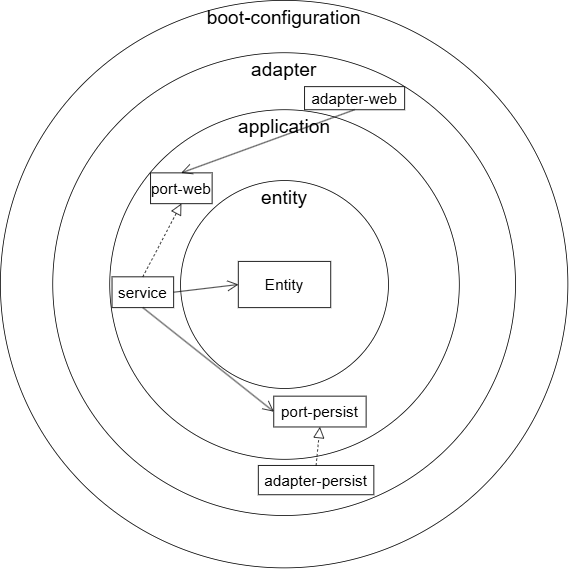

# Hexagonal Web Architecture  
***Building Web Applications Based on Domain-Driven Design (DDD) Principles***

## Why Use Hexagonal Architecture?

- **Faster business code location, minimal impact from changes, and easier maintenance**  
  Adheres to the Single Responsibility Principle. Interfaces are clearly defined and features are isolated by package boundaries, reducing logic coupling.

- **Clear test boundaries, easy to test core logic**  
  Unit tests focus on the `domain` layer, covering core business logic effectively.

- **Business development can start before database design is finalized**  
  All layers depend on the `domain` layer, which can be developed independently of specific data structures.

- **Core business logic remains unaffected by changes in external technology**  
  Changes to external frameworks (e.g., Spring MVC, MyBatis) do not require any changes to the `domain` layer, ensuring high stability.

## Challenges of Hexagonal Architecture

- **High initial development effort**  
  Each layer must define its own Entity/DTO/VO types. Cross-layer reuse is discouraged.

- **Explicit data mapping between layers**  
  As data models are not shared across layers, mapping must be performed manually or with tools, increasing development effort.

- **Many interfaces and complex package structure**  
  Following the single-responsibility principle results in more interfaces and a steeper learning curve for beginners.

---

## Comparison with Traditional Three-Tier Architecture

### Three-Tier Code Structure Example

```java
// Web Layer
LoginController.login(SignInDTO)
// Service Layer
LoginService.login(signInDTO)
// Persistence Layer
UserMapper.queryUser(userCode)
```

### Characteristics of Three-Tier Architecture

1. **Dependency flows uniformly toward the persistence layer**  
   Controller → Service → Mapper.

2. **Unclear class responsibilities**  
   Controllers and Services often contain multiple responsibilities; Mappers are reused by many services.

3. **Complex unit testing**  
   A Service method may depend on many external interfaces, making mocking expensive and difficult.

#### ✅ Pros

- Simple structure, fast development.
- Low design threshold, good for beginners or small projects.
- Reuse across features reduces redundancy.

#### ❌ Cons

- Hard to develop in parallel — must wait for DB design to be complete.
- Business layer tightly coupled with external technologies.
- Changing one part may affect many features.
- High mocking cost and maintenance burden in unit testing.

---



---

## In-Depth Look at Hexagonal Architecture

### Architectural Diagram


### Key Features

1. **All dependencies point toward the domain layer**  
   This includes the Web and Persistence layers. The persistence layer implements interfaces defined in the domain layer, reversing dependency direction.

2. **Ports define interactions with external systems**  
   The `port` layer abstracts communication between the domain and the outside world.

3. **Package-by-feature organization with clear separation of responsibilities**  
   Each feature resides in its own package — including `port`, `adapter`, `service`, and `domain` — enforced by tools like ArchUnit.

4. **Modular and decoupled**  
   Each layer can be split into independent modules (e.g., `adapter.persist`, `port.web`) with clearly defined boundaries.

5. **Single-responsibility interfaces and clear naming**  
   Improves code discoverability and maintenance. For example, all login-related classes start with `Login`.

6. **Easier and more focused unit testing**  
   Interfaces contain only required methods, reducing mocking overhead.

7. **Domain modeling aligns closely with real business**  
   Domain methods express business actions clearly.

8. **Explicit data mapping between layers**  
   Layer-specific models require conversion logic when passing data.

#### ✅ Pros

- **Supports parallel development** — the domain layer can be designed first.
- **Independent and stable domain layer** — not affected by technical framework changes.
- **Clear structure, easier maintenance** — responsibilities are well-separated.
- **Well-designed interfaces improve traceability and maintenance.**
- **Low unit testing cost** — focused testing boundaries.
- **More expressive business logic** — aligns with domain language.
- **Low risk of regressions** — features are isolated.

#### ❌ Cons

- **High learning curve for DDD principles** — requires understanding of domain modeling.
- **High design skill requirement** — careful layering and abstraction needed.
- **Complex initial structure** — more upfront design effort.
- **More entities and mappings** — increased development cost.
- **Limited benefit for small/simple projects.**
- **Code reuse across modules is challenging** — must avoid cross-package service calls.

---

## Real Project Example

A demo project has been open-sourced:  
👉 [hexArchWebApplication](https://github.com/weigangs/hexArchWebApplication)

**Module Dependency Diagram**  


**Reference ArchUnit's official Onion Architecture example**:  
👉 [ArchUnit-Examples](https://github.com/TNG/ArchUnit-Examples/blob/main/example-junit5/src/main/java/com/tngtech/archunit/example/onionarchitecture)

**My Knowledge Mind Map**:  
👉 [bookKnowledgeOutput](https://github.com/weigangs/bookKnowledgeOutput)

---

## Steps to Develop a Feature (with Business Logic)

1. **Define the domain model**  
   In the `domain` layer, abstract the business process and design core entities.

2. **Define Web port interface**  
   In `port.web`, define interfaces and Command classes that connect the controller to the service. Command performs validation during construction.

3. **Implement the port interface**  
   In the `service` layer, implement the `port.web` interface, orchestrate domain calls, and manage business logic.

4. **Build the Web adapter (Controller)**  
   In `adapter.web`, implement the controller logic, receive DTOs, and call services. DTOs may perform basic null checks.

5. **Define the persistence port interface**  
   In `port.persist`, define the interfaces and entities used for data access.

6. **Build the persistence adapter**  
   In `adapter.persist`, implement the persistence interface using MyBatis/JPA to perform database operations.

---

## Additional Development Notes

1. **Use multi-module structure**  
   Apply module dependency constraints to enforce layer isolation.

2. **The `domain` layer is the core and does not depend on any other module**.

3. **Domain types include**:
   - Rich Domain (with state and behavior)
   - Value Object (value holder only)

4. **Command classes validate business rules**  
   If validation fails, throw an exception during construction.

5. **Service layer controls DB transactions**  
   Not the adapter layer — since transactions are tightly bound to business logic.

6. **Simple read-only features can skip the domain layer**  
   Services may call persistence ports directly.

7. **Cross-feature reuse is done via port interfaces**  
   Avoid direct calls to service classes in other packages.

8. **Use tools like MapStruct for entity mapping**  
   Avoid manually writing conversion logic.

9. **An adapter may implement multiple port interfaces**  
   Supports adapter aggregation.

10. **Testing strategies fall into three categories**:
    - **Unit Testing**: Focus on domain methods, aim for >90% coverage.
    - **Integration Testing**: Verify inter-layer logic (e.g., controller calling service).
    - **System Testing**: Full stack from controller to database.

---

## Current Limitations

- The current project is a demo, showcasing structure rather than real business logic.
- **Cross-feature code reuse is still under exploration**, aiming to balance clear boundaries and reusability.

---

# END

For questions or suggestions, feel free to submit an issue on GitHub.
