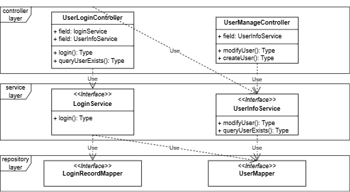
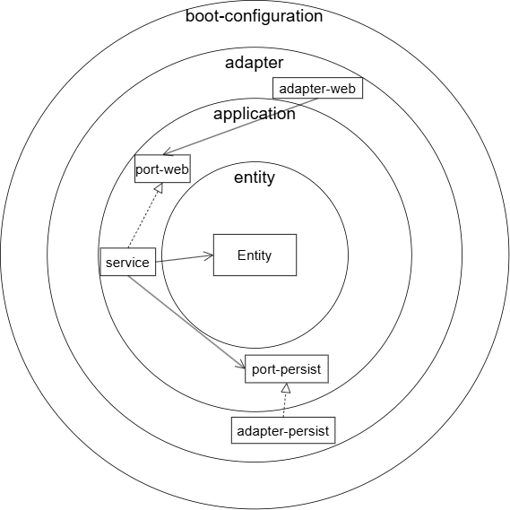

# 六边形 Web 架构  
***基于领域驱动设计思想构建 Web 应用架构***

## 为什么使用六边形架构？

- **定位业务代码更快，修改影响范围小，代码更易维护**  
  遵循单一职责原则，接口定义清晰，各功能通过包进行边界隔离，避免逻辑耦合。

- **测试边界清晰，核心逻辑易测试**  
  单元测试只需聚焦于 domain 层，即可覆盖核心业务逻辑。

- **业务开发无需等待数据表设计完成**  
  各层依赖指向 domain 层，domain 层可独立开发，不依赖具体数据结构。

- **核心业务逻辑不受外部技术变化影响**  
  外部框架（如 Spring MVC、MyBatis）改动时，domain 层无需任何修改，具备良好稳定性。

## 六边形架构的挑战

- **开发前期工作量大**  
  每层需要定义独立的 Entity/DTO/VO，原则上不建议功能间复用。

- **数据需层层映射**  
  各层数据模型不复用，需进行显式映射，增加一定的开发工作。

- **接口数量多，包结构复杂**  
  遵循接口单一职责原则，项目中接口类较多，初学者学习成本较高。

---

## 对比传统三层架构

### 三层代码结构示例

```java
// Web 层
LoginController.login(SignInDTO)
// Service 层
LoginService.login(signInDTO)
// 持久层
UserMapper.queryUser(userCode)
```

### 三层架构的特点

1. **依赖方向统一指向持久层**  
   Controller → Service → Mapper。

2. **类职责不清晰**  
   Controller、Service 通常聚合多个功能，Mapper 被多个服务共用。

3. **单测复杂**  
   一个 Service 方法往往依赖多个外部接口，Mock 代价高。

#### ✅ 优点

- 结构简单，开发快速。
- 设计门槛低，适合初学者或小型项目。
- 可跨功能复用类，降低冗余。

#### ❌ 缺点

- 并行开发困难：需等数据库设计完成。
- 业务层代码易受外部变化影响。
- 修改一处，可能波及多个功能。
- 单元测试 Mock 成本高，维护难度大。

---



---

## 六边形架构详解

### 架构结构


### 特点解析

1. **所有依赖指向 domain 层**  
   包括 Web 与持久层；数据持久层通过实现 domain 定义的接口来“倒置依赖”。

2. **通过 port 层定义与外部系统的交互**  
   port 负责 domain 与外部环境的通信抽象。

3. **按功能包组织，职责隔离清晰**  
   每个功能对应一个包：包含 port、adapter、service、domain，配合 ArchUnit 工具实现强制包隔离。

4. **支持模块化解耦**  
   各层可按模块拆分：如 adapter.persist、port.web，边界明确。

5. **接口职责单一，命名清晰**  
   查找和维护代码效率高，例如登录功能相关类都以 Login 开头。

6. **单元测试更聚焦更易写**  
   接口只包含所需方法，不会 mock 多余内容。

7. **领域建模更贴近真实业务**  
   domain 方法即业务动作，提升表达能力。

8. **数据需映射传输**  
   各层模型独立，需显式映射传递数据。

#### ✅ 优点

- **支持并行开发**，domain 层可先行设计。
- **domain 层独立稳定**，不受技术框架影响。
- **结构清晰、便于维护**，每层职责明确。
- **接口设计合理，查找维护效率高**。
- **单测维护成本低**，测试范围聚焦。
- **业务表达更清晰**，贴合领域语义。
- **各功能独立，修改风险低**。

#### ❌ 缺点

- **DDD 理念门槛高**，需学习与理解领域建模。
- **对设计能力要求高**，需合理划分各层抽象。
- **代码层次多，前期结构准备复杂**。
- **实体多映射多，增加开发成本**。
- **对于简单功能项目收益有限**。
- **代码复用设计难度大**，避免跨包调用。

---

## 项目实战案例

笔者已开源一个 demo 项目：  
👉 [hexArchWebApplication](https://github.com/weigangs/hexArchWebApplication)

**依赖关系示意图**  


**可参考 ArchUnit 官方的 onion 架构示例**：  
👉 [ArchUnit-Examples](https://github.com/TNG/ArchUnit-Examples/blob/main/example-junit5/src/main/java/com/tngtech/archunit/example/onionarchitecture)

**我的知识整理思维导图**：  
👉 [bookKnowledgeOutput](https://github.com/weigangs/bookKnowledgeOutput)

---

## 开发一个功能（含一定计算逻辑）的流程

1. **定义领域模型**  
   在 `domain` 层抽象业务流程，设计核心 Entity。

2. **定义 Web port 接口**  
   在 `port.web` 中定义 controller → service 的接口与 Command 请求参数，Command 构造时实现参数校验逻辑。

3. **实现 port 接口**  
   在 `service` 层实现 port 接口，组织调用 domain，处理业务流程。

4. **构建 Web 适配器（Controller）**  
   在 `adapter.web` 中定义 Controller，接收 DTO，调用 service 层。DTO 中可进行简单判空等非业务校验。

5. **定义持久化 port 接口**  
   在 `port.persist` 中定义与数据库交互的接口及实体。

6. **构建持久化适配器**  
   在 `adapter.persist` 中实现持久化接口，调用 MyBatis/JPA 实现具体数据操作。

---

## 开发步骤补充说明

1. **使用多模块组织项目结构**，通过模块间依赖约束实现层级隔离。
2. **domain 层不依赖任何其他模块**，是系统最核心层。
3. **domain 类型分为**：
   - Rich Domain（有状态、有行为）
   - Value Object（仅承载值）

4. **Command 类校验业务规则**，不通过则构造失败，直接抛异常。
5. **数据库事务由 service 层控制**，而不是 adapter 层，因为事务逻辑与业务流程紧密相关。
6. **简单只读功能可省略 domain 层**，service 调用 persist 即可。
7. **可在 service 层通过 port 实现跨包代码复用**，而非直接跨包依赖其它 service 类。
8. **使用 MapStruct 等工具进行实体映射，避免手动写转换逻辑**。
9. **一个 adapter 可实现多个 port 接口**，支持聚合适配。
10. **测试策略分为三类**：
    - 单元测试：覆盖 domain 中的方法，尽量覆盖率 >90%。
    - 集成测试：验证各层调用关系，如 controller 调 service。
    - 系统测试：从 controller 到数据库的全链路验证。

---

## 当前存在的问题

- 当前项目为 demo，仅展示结构，未覆盖全部真实业务场景。
- **跨功能代码复用机制仍在思考探索中**，如何在保持边界清晰的同时提升复用性。

---

# END

如有问题或建议，欢迎在 GitHub 提 issue 交流。